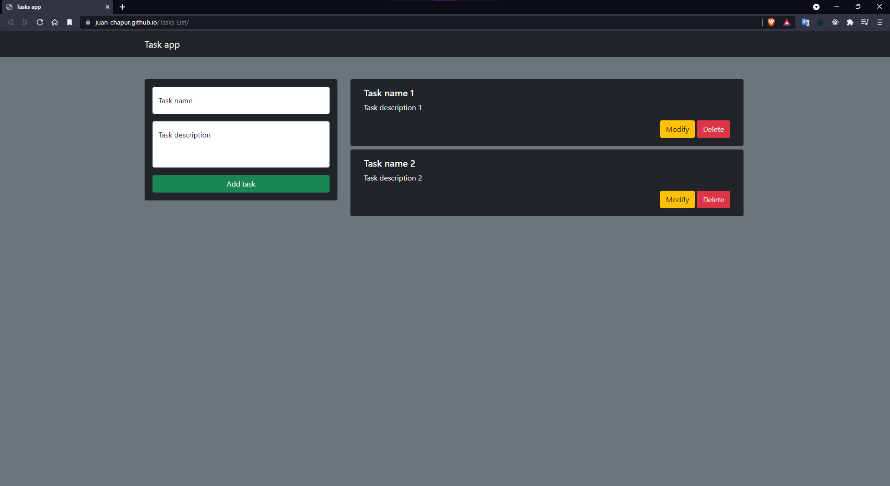
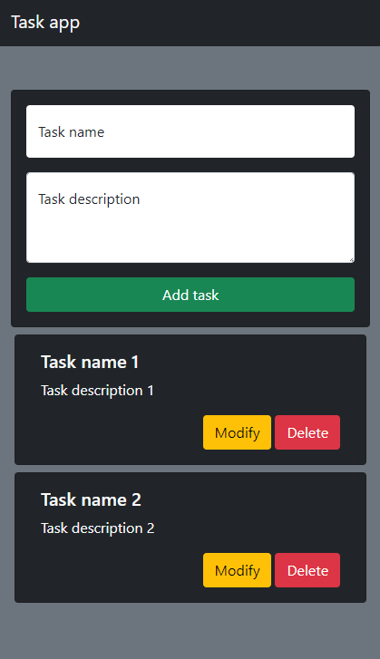

# Tasks-List✔️

## Introduccion🧠

- En este proyecto encontraremos un programa el cual nos permite agregar, modificar y eliminar tareas a forma de TODO.
- Este programa hace uso del localStorage perteneciente al navegador, es decir que los datos que ingresemos a este programa, no se eliminaran al cerrar la pagina.

## Instalacion⚙️

- Este proyecto no requiere la instalacion de ningun programa extra.

## Recomendacion👾

- Ejecutar meidante la extencion [Live Server](https://marketplace.visualstudio.com/items?itemName=ritwickdey.LiveServer)

## Screenshots📸

### Desktop

### Mobile

## Prueba 🎮

[Click aqui](https://juan-chapur.github.io/Tasks-List/) para probar :D